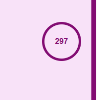

# General Knowledge Quiz

Welcome !

This document will provide an overview of the quiz structure, content and technologies used.

The quiz is designed to test the user's knowledge across various topics with 10 randomly chosen questions from a pool of 15. Each question includes four answer options, and the user needs to select the correct one. Feedback is provided for each question, and once the user has selected an answer, the other option buttons will be disabled. Additionally, the timer is set for 5 minutes to complete the quiz.

The quiz site is responsive across all screen sizes, ensuring a consistent user experience on desktops, tablets, and mobile devices.

The live link can be found here: [General Knowledge Quiz](https://lin2907.github.io/general-knowledge-quiz/) .

## Design

### Colors

 + Border, Header and Buttons color : Purple note.
 + Quiz area background color : Light purple note .
 + Result feedback and score colors: Red and Green.

 
  

## Typography

 + Verdana Sans Serif: The font gives off a classic elegance.

## Technology used
 + HTML , CSS , JavaScript
 + GitHub, Gitpod

## How to Play

1. Launch the quiz.
2. Read each question carefully.
3. Select the answer you believe is correct.
4. Receive instant feedback on your choice.
5. Once you've selected an answer, the other option buttons will be disabled.
6. Continue to the next question.
7. Repeat steps 2-6 for all 10 questions.
View your total score at the end of the quiz.

### Feedback
 + Correct Answer: Receive positive feedback and move on to the next question.
 + Incorrect Answer: Learn from your mistake, you can play the quiz again and give it another try to find the correct answer

### Scoring System
 + Each correct answer earns 1 point for the user.
 + The total score is displayed at the end of the quiz.

### Timer
 + A timer is set for 5 minutes to complete the quiz. The quiz needs to be finished within the time limit for the best experience.

## Features

### Landing Page
  + The landing page displays the quiz header, hero image, also the buttons for instructions and starting the quiz. Click on the "Start" button closes the instructions modal if previously opened.

  
     

  + The Landing page also includes a modal with instructions on how to play the quiz. This modal provides guidance on navigating the quiz. User can access the instructions by clicking the "Instructions" button on the landing page.

  

### Randomized Questions
   + 10 questions are randomly selected from a pool of 15, ensuring a different user experience each time the quiz is played.

### Multiple Choice
 + Each question offers four answer options, but once the user selects an answer, the other option buttons are disabled to prevent multiple selections.

 

### Feedback
 + User Receives an immediate feedback on each question, while the correct answer is not revealed , in order to challenge the user to play the quiz again and to improve the score while disovering the correct answers.
 + For correct answers, the feedback is shown in green, same as the score displayed in the score area. If an answer is incorrect, the feedback will appear in red, again with the score visible in the same red color. 

 

### Scoring 
  + The total score is displayed at the end of the quiz, based on the number of correct and wrong answers.

### Timer
 + A timer is set for 5 minutes to complete the quiz, adding a sense of urgency and excitement.

 

### Images

Each question features unique image, which is adding to the visual user experience.

### Score-Based Feedback
  + The feedback image and comment vary depending on the total score achieved.

### Restart Option
  + At the end of the quiz or if the timer runs out, a Restart button is available. This provides the user with the opportunity to play the quiz again and improve the score.

### Features left to Implement
It includes user feedback area and links to support resources regarding the correct answers, ensuring that users can get more information.

# Testing

1. ## Functionality

  + Verified that all interactive elements (buttons , timer) are functional.
  + Tested any user inputs and ensured they produce the expected outcomes.
Checked for any error messages or unexpected behavior.

2. ## Layout and Design testing

 + Reviewed the layout and design of the website. Ensured that the content is well-structured and aligned.

 + Tested the responsiveness of the website by using developer tools to simulate different device sizes.

 + Confirmed that the website looks visually appealing on various screen sizes.

3. ## Reporting issues
 + No known issues

## Validator Testing

 + HTML
    * No errors were returned when passing through the official [W3C validator](https://validator.w3.org/)

    

+ CSS

  * No errors were found when passing through the official [(Jigsaw) validator](https://jigsaw.w3.org/css-validator/)

   

+ JavaScript
  * No errors were found when passing through the [JSHint](https://jshint.com/).

  

## Accesibility

I've confirmed that the colors and fonts are chosen are easy to read and accessible by running it through Lighthouse in devtools.

## Bugs
 + Issue: Timer not working correctly on quiz restart, on each second blink it shows 2 values. 
 + Cause: Set timer and reset timer function were used withing the same scope of StartQuiz function.
 + Fix: Removed the setTimer function.

 + Issue: The Quiz question images were not visible on the deployed version.
 + Cause : On the deployed version, the files were not recognized by the path given, I therefore added "../assets/" instead of  "./assets " .
 + Fix : Changed the path to the images .

## Unfixed Bugs

 + No known issues

## Deployment

The site was deployed to GitHub pages. The steps taken to deploy are as follows:

1. Log in to GitHub.
2. Navigate to https://github.com/Lin2907/general-knowledge-quiz in the list of repositories.
3. In the GitHub repository, navigate to the Settings tab.
4. In Settings scroll down to GitHub pages which opens in a new page.
5. From the source section drop-down menu, select the Main Branch
Once the main branch has been selected, the page is automatically refreshed and a display indicates the successful deployment and the link to the address. The link to the live website is here: [General Knowledge Quiz](https://lin2907.github.io/general-knowledge-quiz/) .

 ## Forking the repository

In order to fork the repository to make a copy the steps are:

  + Log into GitHub and locate the repository for https://github.com/Lin2907/general-knowledge-quiz.
  + At the top of the repository above settings locate the 'Fork' button
There is now a copy of the repository in the Github account.

 ## Cloning the repository

1. On GitHub navigate to the main page of the repository
2. Above the list of files click the dropdown code menu
3. Select the https option and copy the link
4. Open the GitPod Bash terminal
5. Change the current working directory to the desired destination location
6. Type the git clone command with the copied URL: git clone https://lin2907.github.io/general-knowledge-quiz.git
7. Press enter to create the local clone

 ## Credits

+ Content

  * For randomized questions, Durstenfeld shuffle, an optimized version of Fisher-Yates was used.

  * Inspired by W3C schools and Code Institute lessons for creating timer function.

  + Score area was implemented similar as in "Love Maths" school project.
+ Media
  + Questions, options and answers were taken from [Quiz Trivia Games](www.quiztriviagames.com) .

  + Images were taken from [Pexels](https://www.pexels.com/) .  
   
  + Favicon was generated with [Favicon.io](https://favicon.io/favicon-generator/).

Enjoy the Challenge !

